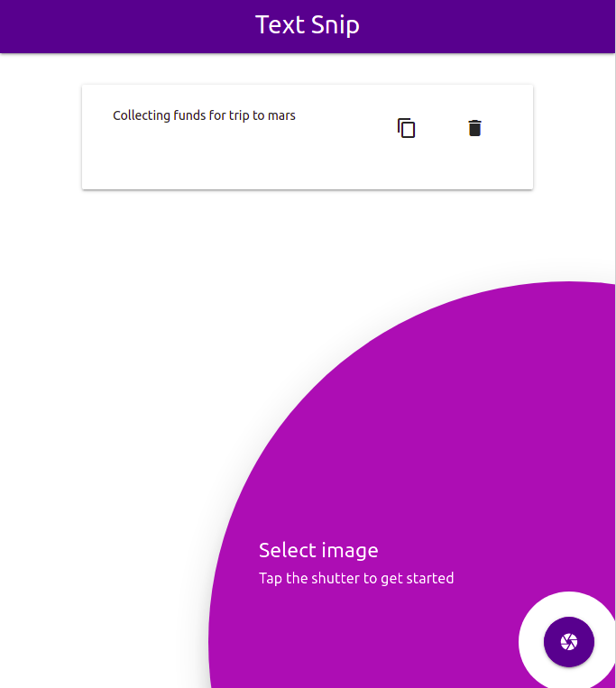
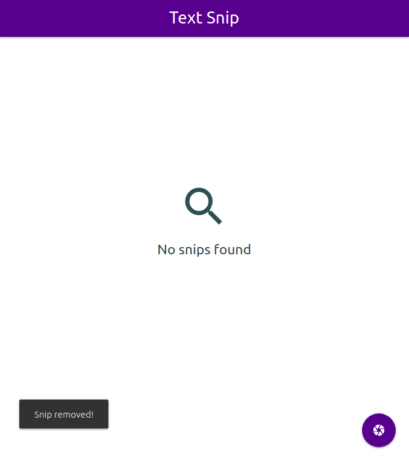
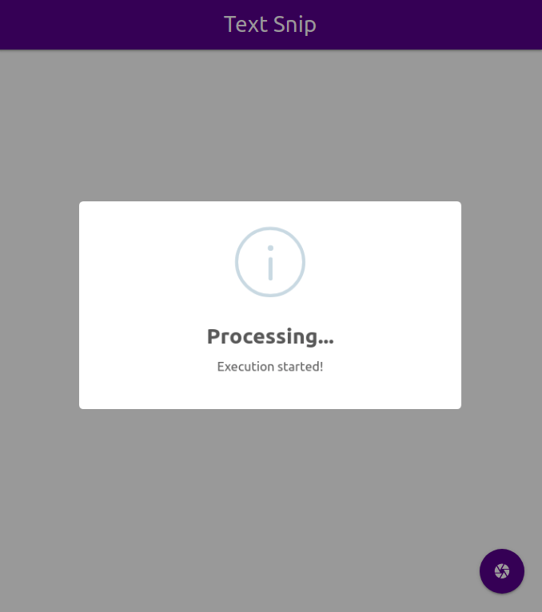

## Text Snip
Simple utility to extract text from screenshots written for web

<br/>

### Live demo
https://accelerator-one.github.io/text-snip/

<br/>

### Screenshots
<br/>

  
<br/>

  
<br/>

  
<br/>

<br/>

### Usage
- Tap the shutter and select the screenshot to start execution.
- Time taken is directly proportional to factors like:
  * Internet connectivity ( Initial load )
  * Device processing power
  * Browser variants and in-browser optimizations

- After processing is complete, you can copy the results to clipboard.  
  ( Operation is completely performed on the device )

<br/>

### Caution
- Not recommended to use the web app in the following conditions :
    - High-resolution images
    - Low contrast ratio
    - Low specification devices

<br/>

### Prequisites
Make sure you have below development dependencies installed on your CLI environment :
- npm
- node

<br/>

### Deployment
If you want to deploy this project on your hosting provider, follow the steps below :

- Clone the repository
  ```bash
  git clone https://github.com/Accelerator-One/text-snip.git
  ```

- Install project dependencies
  ```bash
  npm install
  ```

- Running the project locally
  ```bash
  npm start
  ```    

- Apply tweaks if needed and generate the build
  ```bash
  npm run build
  ```

<br/>

### Issues
In case of any problems during implementation, file them under *Issues* section of this repository